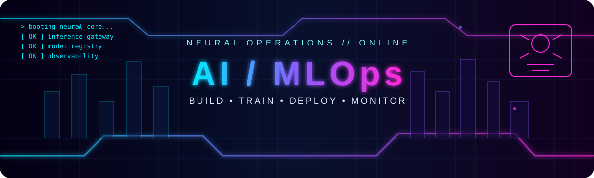
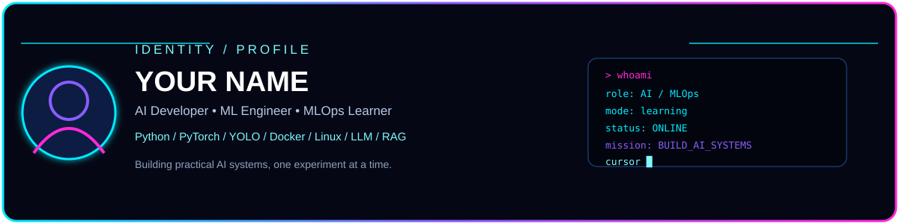
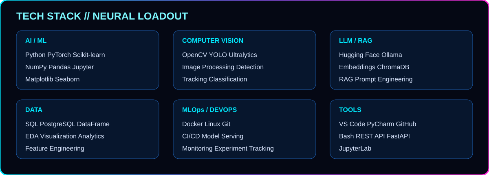
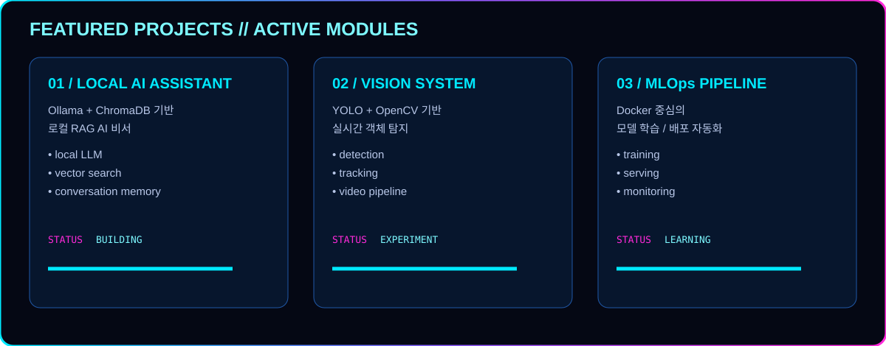
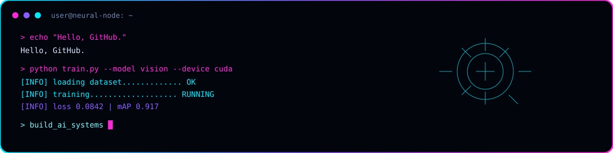

<div align="center">



</div>

<div align="center">

# ⚡ YOUR NAME

**AI Developer · ML Engineer · MLOps Learner**

`Python` · `PyTorch` · `YOLO` · `OpenCV` · `Docker` · `Linux` · `Hugging Face` · `Ollama` · `ChromaDB`

</div>

---

<div align="center">



</div>

## 🧠 SYSTEM / ABOUT ME

> AI와 MLOps를 공부하면서 **직접 실행되는 시스템**을 만드는 것을 목표로 하고 있습니다.  
> 데이터 분석 → 모델 학습 → 추론 → 컨테이너화 → 배포/모니터링까지 연결하는 흐름을 익히는 중입니다.

- 🔭 Currently building: **Local AI Assistant / Computer Vision / RAG**
- 🌱 Currently learning: **MLOps / Kubernetes / CI/CD / Model Serving**
- 🧪 Interested in: **LLM, RAG, Computer Vision, Automation**
- 🐧 Environment: **Linux / Docker / CUDA**
- ⚡ Motto: **Build → Train → Deploy → Monitor**

---

<div align="center">



</div>

## 🚀 FEATURED PROJECTS

<div align="center">



</div>

### 01 · Local AI Assistant
- Ollama 기반 로컬 LLM
- ChromaDB Vector Search
- RAG 기반 질의응답
- 대화 기록 / 문서 검색

### 02 · Computer Vision System
- YOLO 기반 Object Detection
- OpenCV 영상 처리
- 실시간 추론 파이프라인
- Docker 실행 환경

### 03 · MLOps Pipeline
- 모델 학습 환경 컨테이너화
- 실험 / 모델 관리
- Serving 및 모니터링 학습
- 향후 CI/CD + Kubernetes 확장

---

<div align="center">



</div>

## 📊 GITHUB ACTIVITY

> GitHub의 실제 통계 이미지를 추가하고 싶다면 아래 영역에 원하는 stats 서비스의 이미지를 넣으시면 됩니다.

<div align="center">

<!-- 예시:

-->

</div>

---

## 🧩 CURRENT LEARNING

```text
MLOps            ███████████████░░░  80%
Linux / Docker   ████████████████░░  85%
Computer Vision  ██████████████░░░░  75%
LLM / RAG        █████████████░░░░░  70%
Kubernetes       ████████░░░░░░░░░░  40%
CI/CD            ███████░░░░░░░░░░░  35%
```

## 🛠️ TOOLBOX

| Category | Tools |
|---|---|
| Language | Python, SQL, Bash |
| ML | PyTorch, Scikit-learn |
| Vision | OpenCV, YOLO, Ultralytics |
| LLM | Hugging Face, Ollama |
| RAG | ChromaDB, Embeddings |
| Data | Pandas, NumPy, Matplotlib |
| MLOps | Docker, Linux, Git |
| Environment | JupyterLab, VS Code, PyCharm |

---

## 📡 SYSTEM LOG

```text
[BOOT] neural-profile initialized
[ OK ] Python environment
[ OK ] Linux environment
[ OK ] Docker environment
[ OK ] Computer Vision stack
[ OK ] Local LLM stack
[ OK ] Vector DB
[RUN ] MLOps learning pipeline
```

---

<div align="center">


</div>

<div align="center">

### `01001001 01000001` · KEEP LEARNING · KEEP BUILDING

</div>
